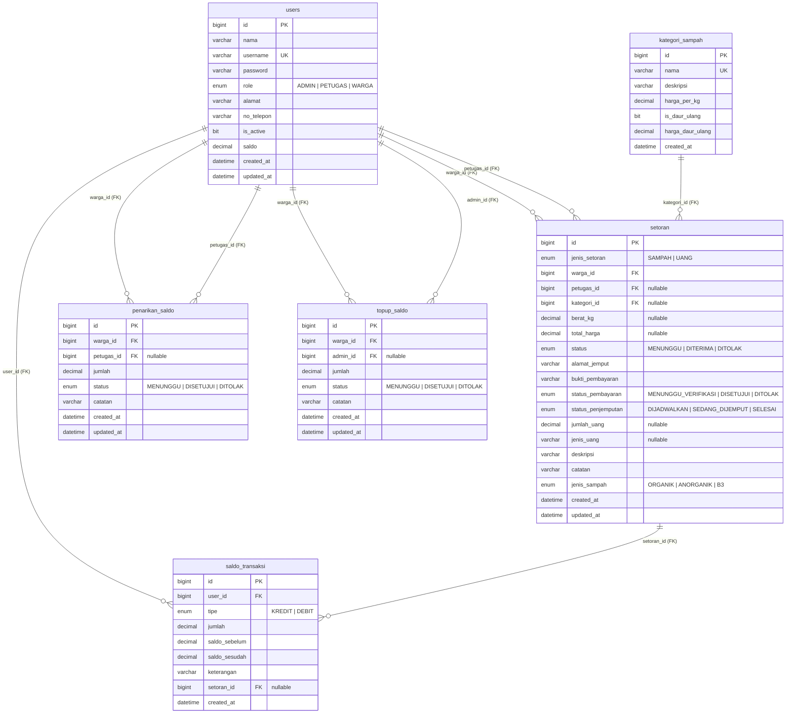

# LAPORAN SISTEM TRASHFORMER

**Sistem Digital Pengelolaan Bank Sampah Berbasis Web**

---

## BAB I — PENDAHULUAN

### 1.1 Latar Belakang

Pengelolaan sampah di tingkat masyarakat, khususnya pada bank sampah, masih banyak dilakukan secara manual. Proses pencatatan setoran sampah sering menggunakan buku atau metode sederhana yang rentan terhadap kesalahan pencatatan, kehilangan data, serta sulit dalam melakukan pencarian data historis.

Selain itu, kurangnya sistem yang terintegrasi menyebabkan informasi mengenai jumlah sampah, kategori sampah, riwayat transaksi, serta saldo nasabah tidak dapat dipantau secara efektif. Warga tidak memiliki transparansi terhadap nilai ekonomis dari sampah yang mereka setorkan, sementara petugas kesulitan dalam memverifikasi pembayaran dan mengelola penjemputan sampah.

Dengan adanya perkembangan teknologi informasi, diperlukan sebuah sistem digital yang mampu mentransformasikan proses pengelolaan bank sampah menjadi lebih terstruktur, akurat, dan mudah diakses oleh seluruh pemangku kepentingan (admin, petugas, dan warga).

Oleh karena itu, dirancang sistem **TRASHFORMER** yang berfungsi untuk mengelola data pengguna (warga, petugas, admin), pencatatan setoran sampah dan uang, pengelompokan kategori sampah dengan harga per kg, penyimpanan riwayat transaksi, sistem saldo digital (bank sampah), verifikasi pembayaran dan penjemputan, serta penyajian laporan dan statistik secara sistematis.

### 1.2 Rumusan Masalah

1. Bagaimana merancang sistem pengelolaan data pengguna (warga, petugas, admin) secara terstruktur dengan sistem role-based?
2. Bagaimana mencatat setoran sampah dan setoran uang secara digital dan terintegrasi dalam satu sistem?
3. Bagaimana mengelompokkan sampah berdasarkan kategori dinamis dengan harga per kg dan fitur daur ulang?
4. Bagaimana menyimpan dan menampilkan riwayat transaksi serta mutasi saldo bank sampah?
5. Bagaimana menghasilkan laporan total sampah, distribusi per kategori, dan tren per bulan secara akurat?
6. Bagaimana memfasilitasi verifikasi pembayaran, penjemputan, serta penarikan dan topup saldo?

### 1.3 Tujuan Sistem yang Akan Dibangun

- Membangun sistem pengelolaan bank sampah berbasis digital dengan arsitektur MVC server-rendered.
- Meningkatkan efisiensi pencatatan setoran sampah dan uang.
- Menyediakan transparansi data melalui riwayat transaksi dan mutasi saldo.
- Menyajikan laporan dan statistik sampah secara sistematis.
- Memfasilitasi sistem bank sampah digital (saldo, topup, penarikan).

### 1.4 Batasan Sistem

- Sistem menggunakan arsitektur **MVC server-rendered** (Spring Boot + Thymeleaf), bukan REST API.
- Sistem hanya mencakup backend dan frontend terintegrasi dalam satu aplikasi monolit.
- Sistem tidak mencakup integrasi dengan pihak ketiga seperti payment gateway eksternal.
- Manajemen role terbatas pada tiga level: ADMIN, PETUGAS, dan WARGA.
- Kategori sampah bersifat dinamis (dikelola melalui database), tidak hardcoded.

---

## BAB II — LANDASAN TEORI

### 2.1 Penjelasan Konsep OOP yang Digunakan

#### 2.1.1 Encapsulation

Encapsulation merupakan konsep dalam Object Oriented Programming (OOP) yang digunakan untuk membungkus data (atribut) dan metode (fungsi) dalam satu kesatuan kelas. Atribut dalam kelas dibuat bersifat `private` sehingga tidak dapat diakses langsung dari luar kelas. Akses terhadap data dilakukan melalui method `getter` dan `setter`, sehingga data lebih aman dan terkontrol.

Pada sistem TRASHFORMER, encapsulation diterapkan pada setiap entity class seperti `User`, `Setoran`, dan `KategoriSampah`, di mana atribut seperti `id`, `nama`, dan `beratKg` dibuat `private` dan hanya dapat diakses melalui method getter/setter publik. Contoh:

```java
@Entity
@Table(name = "users")
public class User {
    @Id
    @GeneratedValue(strategy = GenerationType.IDENTITY)
    private Long id;

    @Column(nullable = false)
    private String nama;

    @Column(unique = true, nullable = false, length = 50)
    private String username;

    @Column(nullable = false)
    private Role role;

    @Column(precision = 15, scale = 2)
    private BigDecimal saldo = BigDecimal.ZERO;

    // Getter dan setter untuk setiap field
    public Long getId() { return id; }
    public String getNama() { return nama; }
    public void setNama(String nama) { this.nama = nama; }
    // ... setter/getter lainnya
}
```

#### 2.1.2 Inheritance (Implementasi via Role-Based)

Pada sistem TRASHFORMER, inheritance secara klasik tidak diterapkan dalam bentuk pewarisan class entity. Sebagai gantinya, sistem menggunakan **pendekatan role-based** di mana satu entity `User` menangani seluruh jenis pengguna (ADMIN, PETUGAS, WARGA) dengan bantuan enum `Role`:

```java
public enum Role {
    ADMIN,
    PETUGAS,
    WARGA
}
```

Pendekatan ini dipilih karena lebih fleksibel dan sesuai dengan pola desain database relasional. Meskipun tidak menggunakan inheritance class, konsep pewarisan tetap terlihat pada **abstract class dan interface di layer service**, misalnya:

- **SecurityConfig** menggunakan `AuthenticationSuccessHandler` (interface) yang diimplementasikan sebagai lambda expression untuk redirect berdasarkan role.
- **CustomUserDetailsService** mengimplementasikan `UserDetailsService` (interface dari Spring Security).

#### 2.1.3 Polymorphism

Polymorphism adalah kemampuan suatu method untuk memiliki banyak bentuk. Dalam sistem TRASHFORMER, polymorphism diterapkan melalui:

**Method Overloading:**

Method `createSetoranSampah` dibedakan berdasarkan parameter:

```java
// Untuk petugas (input langsung, auto DITERIMA)
public Setoran createSetoranSampah(Long wargaId, Long kategoriId, BigDecimal beratKg, String catatan)

// Untuk warga (self-report, dengan alamat jemput dan bukti pembayaran)
public Setoran createSetoranSampahWarga(Long wargaId, Long kategoriId, BigDecimal beratKg,
                                         String alamatJemput, String catatan, String buktiPembayaran)
```

**Polymorphism pada Repository (Spring Data JPA):**

Semua repository interface (`UserRepository`, `SetoranRepository`, `KategoriSampahRepository`, dll.) mewarisi method dari `JpaRepository` seperti `findAll()`, `save()`, `findById()`, dan dapat menambahkan method query kustom yang diimplementasikan secara otomatis oleh Spring Data JPA.

#### 2.1.4 Abstraction

Abstraction adalah konsep menyembunyikan detail implementasi dan hanya menampilkan fungsi utama kepada pengguna. Pada sistem TRASHFORMER, abstraction diterapkan melalui:

1. **Interface Repository (Spring Data JPA):** Cukup mendeklarasikan method signature, implementasi query dihasilkan secara otomatis.

```java
public interface UserRepository extends JpaRepository<User, Long> {
    Optional<User> findByUsername(String username);
    List<User> findByRole(Role role);
    long countByRole(Role role);
}
```

2. **Layanan Service:** Class service (`SetoranService`, `UserService`, `BankSampahService`) menyembunyikan kompleksitas logika bisnis dari controller. Controller hanya memanggil method service tanpa tahu detail implementasi di dalamnya.

### 2.2 Penjelasan Teknologi yang Digunakan

#### 2.2.1 Java 17+

Java merupakan bahasa pemrograman berbasis objek yang digunakan untuk membangun sistem backend. Versi Java 17 dipilih karena merupakan versi LTS (Long Term Support) yang stabil dengan fitur modern seperti `record`, `sealed classes`, dan `pattern matching`.

#### 2.2.2 Spring Boot 3.3.5

Spring Boot adalah framework Java yang digunakan untuk mempermudah pengembangan aplikasi backend. Framework ini menyediakan konfigurasi otomatis (auto-configuration) sehingga mempercepat proses development. Spring Boot 3.3.5 menggunakan Spring Framework 6 dan Jakarta EE.

#### 2.2.3 Spring Data JPA (Hibernate)

Spring Data JPA digunakan sebagai ORM (Object Relational Mapping) untuk menghubungkan antara object Java dengan database relasional. Dengan JPA, proses query database menjadi lebih sederhana melalui method naming convention dan annotasi `@Query`.

#### 2.2.4 Spring MVC + Thymeleaf

Spring MVC adalah framework web Spring yang mengimplementasikan pola desain Model-View-Controller. Thymeleaf digunakan sebagai template engine server-side untuk merender HTML. Data dikirim dari controller ke view melalui model, bukan melalui JSON.

#### 2.2.5 Spring Security 6

Spring Security digunakan untuk autentikasi dan otorisasi berbasis role. Setiap pengguna memiliki role (ADMIN/PETUGAS/WARGA) yang menentukan akses ke halaman tertentu. Password dienkripsi menggunakan BCrypt.

#### 2.2.6 MySQL / MariaDB

Database relasional digunakan untuk menyimpan data pengguna, kategori sampah, setoran, transaksi saldo, penarikan, dan topup. Sistem ini menggunakan MySQL atau MariaDB dengan Hibernate DDL auto-update.

### 2.3 Penjelasan Arsitektur Sistem

Sistem TRASHFORMER menggunakan **Layered Architecture** (arsitektur berlapis) yang terdiri dari:

1. **View Layer (Thymeleaf Templates)** — Menampilkan antarmuka pengguna dalam bentuk HTML.
2. **Controller Layer** — Menerima request HTTP dari browser, memproses input form, dan mengembalikan halaman HTML.
3. **Service Layer** — Menangani logika bisnis sistem, bersifat `@Transactional`.
4. **Repository Layer** — Mengakses database melalui Spring Data JPA.
5. **Model Layer (Entity)** — Representasi data dalam bentuk class JPA entity.

**Alur kerja sistem:**

```
Browser → Controller → Service → Repository → Database
                    ↓
              Thymeleaf Template (View) → HTML response
```

### 2.4 Deployment

Sistem TRASHFORMER dapat dijalankan di berbagai platform:

- **Development:** `./mvnw spring-boot:run`
- **Production Build:** `./mvnw clean package` → menghasilkan JAR yang dijalankan dengan `java -jar`

---

## BAB III — PERANCANGAN SISTEM

### 3.1 Design Database

Sistem backend TRASHFORMER menggunakan database relasional (MySQL/MariaDB) untuk mengelola data operasional bank sampah. Rancangan database ini terdiri dari **6 tabel** yang saling berelasi.

### 3.1.1 Entity Relationship Diagram (ERD)



### 3.1.2 Daftar Tabel dan Atribut

#### Tabel `users`

Menyimpan data semua pengguna sistem (ADMIN, PETUGAS, WARGA) dalam satu tabel dengan pembeda kolom `role`.

| Kolom | Tipe | Keterangan |
|---|---|---|
| id | BIGINT (PK) | Auto increment |
| nama | VARCHAR(255) | Nama lengkap |
| username | VARCHAR(50) | Username unik untuk login |
| password | VARCHAR(255) | Password terenkripsi BCrypt |
| role | ENUM('ADMIN','PETUGAS','WARGA') | Role pengguna |
| alamat | VARCHAR(255) | Alamat tempat tinggal |
| no_telepon | VARCHAR(255) | Nomor kontak |
| is_active | BIT | Status aktif (null = aktif) |
| saldo | DECIMAL(15,2) | Saldo bank sampah |
| created_at | DATETIME | Waktu dibuat |
| updated_at | DATETIME | Waktu diperbarui |

#### Tabel `kategori_sampah`

Menyimpan jenis-jenis klasifikasi sampah dengan harga per kg dan opsi daur ulang.

| Kolom | Tipe | Keterangan |
|---|---|---|
| id | BIGINT (PK) | Auto increment |
| nama | VARCHAR(255) | Nama kategori (unik) |
| deskripsi | VARCHAR(255) | Penjelasan kategori |
| harga_per_kg | DECIMAL(10,2) | Harga per kilogram |
| is_daur_ulang | BIT | Apakah bisa didaur ulang |
| harga_daur_ulang | DECIMAL(10,2) | Harga khusus daur ulang |
| created_at | DATETIME | Waktu dibuat |

#### Tabel `setoran`

Tabel utama untuk mencatat setiap transaksi setoran, baik sampah (`SAMPAH`) maupun uang (`UANG`). Tabel ini menggunakan pendekatan **unified** dengan kolom `jenis_setoran` sebagai pembeda.

| Kolom | Tipe | Keterangan |
|---|---|---|
| id | BIGINT (PK) | Auto increment |
| jenis_setoran | ENUM('SAMPAH','UANG') | Jenis setoran |
| warga_id | BIGINT (FK) | Foreign Key ke users (warga) |
| petugas_id | BIGINT (FK) | Foreign Key ke users (petugas), nullable |
| kategori_id | BIGINT (FK) | Foreign Key ke kategori_sampah, nullable |
| berat_kg | DECIMAL(10,2) | Berat sampah dalam kg |
| total_harga | DECIMAL(12,2) | Total harga (berat x harga_per_kg) |
| status | ENUM('MENUNGGU','DITERIMA','DITOLAK') | Status setoran |
| alamat_jemput | VARCHAR(255) | Alamat penjemputan |
| bukti_pembayaran | VARCHAR(255) | Nama file bukti pembayaran |
| status_pembayaran | ENUM('MENUNGGU_VERIFIKASI','DISETUJUI','DITOLAK') | Status pembayaran |
| status_penjemputan | ENUM('DIJADWALKAN','SEDANG_DIJEMPUT','SELESAI') | Status penjemputan |
| jumlah_uang | DECIMAL(15,2) | Jumlah uang (untuk setoran UANG) |
| jenis_uang | VARCHAR(255) | Jenis uang (untuk setoran UANG) |
| deskripsi | VARCHAR(255) | Deskripsi tambahan |
| catatan | VARCHAR(255) | Catatan petugas/warga |
| jenis_sampah | ENUM('ORGANIK','ANORGANIK','B3') | Klasifikasi jenis sampah |
| created_at | DATETIME | Waktu dibuat |
| updated_at | DATETIME | Waktu diperbarui |

#### Tabel `saldo_transaksi`

Menyimpan riwayat mutasi saldo bank sampah setiap pengguna.

| Kolom | Tipe | Keterangan |
|---|---|---|
| id | BIGINT (PK) | Auto increment |
| user_id | BIGINT (FK) | Foreign Key ke users |
| tipe | ENUM('KREDIT','DEBIT') | Jenis transaksi |
| jumlah | DECIMAL(15,2) | Jumlah transaksi |
| saldo_sebelum | DECIMAL(15,2) | Saldo sebelum transaksi |
| saldo_sesudah | DECIMAL(15,2) | Saldo setelah transaksi |
| keterangan | VARCHAR(255) | Keterangan transaksi |
| setoran_id | BIGINT (FK) | Foreign Key ke setoran, nullable |
| created_at | DATETIME | Waktu transaksi |

#### Tabel `penarikan_saldo`

Menyimpan permintaan penarikan saldo bank sampah oleh warga.

| Kolom | Tipe | Keterangan |
|---|---|---|
| id | BIGINT (PK) | Auto increment |
| warga_id | BIGINT (FK) | Foreign Key ke users (warga) |
| petugas_id | BIGINT (FK) | Foreign Key ke users (petugas), nullable |
| jumlah | DECIMAL(15,2) | Jumlah penarikan |
| status | ENUM('MENUNGGU','DISETUJUI','DITOLAK') | Status penarikan |
| catatan | VARCHAR(255) | Catatan |
| created_at | DATETIME | Waktu dibuat |
| updated_at | DATETIME | Waktu diperbarui |

#### Tabel `topup_saldo`

Menyimpan permintaan topup saldo bank sampah oleh warga.

| Kolom | Tipe | Keterangan |
|---|---|---|
| id | BIGINT (PK) | Auto increment |
| warga_id | BIGINT (FK) | Foreign Key ke users (warga) |
| admin_id | BIGINT (FK) | Foreign Key ke users (admin), nullable |
| jumlah | DECIMAL(15,2) | Jumlah topup |
| status | ENUM('MENUNGGU','DISETUJUI','DITOLAK') | Status topup |
| catatan | VARCHAR(255) | Catatan |
| created_at | DATETIME | Waktu dibuat |
| updated_at | DATETIME | Waktu diperbarui |

### 3.1.3 Penjelasan Relasi Antar Tabel

1. **Relasi users ke setoran (One-to-Many):**
   - Satu warga (`role = WARGA`) dapat memiliki banyak setoran. Dihubungkan melalui FK `warga_id`.
   - Satu petugas (`role = PETUGAS`) dapat menangani banyak setoran. Dihubungkan melalui FK `petugas_id`.

2. **Relasi kategori_sampah ke setoran (One-to-Many):**
   - Satu kategori sampah dapat muncul di banyak setoran. Dihubungkan melalui FK `kategori_id`.

3. **Relasi users ke saldo_transaksi (One-to-Many):**
   - Satu pengguna dapat memiliki banyak transaksi saldo. Dihubungkan melalui FK `user_id`.

4. **Relasi users ke penarikan_saldo (One-to-Many):**
   - Satu warga dapat mengajukan banyak penarikan. Dihubungkan melalui FK `warga_id`.
   - Satu petugas dapat memproses banyak penarikan. Dihubungkan melalui FK `petugas_id`.

5. **Relasi users ke topup_saldo (One-to-Many):**
   - Satu warga dapat mengajukan banyak topup. Dihubungkan melalui FK `warga_id`.
   - Satu admin dapat memproses banyak topup. Dihubungkan melalui FK `admin_id`.

6. **Relasi setoran ke saldo_transaksi (One-to-Many):**
   - Satu setoran daur ulang dapat menghasilkan satu transaksi kredit saldo. Dihubungkan melalui FK `setoran_id`.

### 3.2 Desain OOP

```mermaid
classDiagram
    %% ===== ENUMS =====
    class Role {
        <<enumeration>>
        ADMIN
        PETUGAS
        WARGA
    }
    class JenisSetoran {
        <<enumeration>>
        SAMPAH
        UANG
    }
    class JenisSampah {
        <<enumeration>>
        ORGANIK
        ANORGANIK
        B3
    }
    class StatusSetoran {
        <<enumeration>>
        MENUNGGU
        DITERIMA
        DITOLAK
    }
    class StatusPembayaran {
        <<enumeration>>
        MENUNGGU_VERIFIKASI
        DISETUJUI
        DITOLAK
    }
    class StatusPenjemputan {
        <<enumeration>>
        DIJADWALKAN
        SEDANG_DIJEMPUT
        SELESAI
    }
    class TipeTransaksi {
        <<enumeration>>
        KREDIT
        DEBIT
    }
    class StatusPenarikan {
        <<enumeration>>
        MENUNGGU
        DISETUJUI
        DITOLAK
    }
    class StatusTopup {
        <<enumeration>>
        MENUNGGU
        DISETUJUI
        DITOLAK
    }

    %% ===== ENTITIES =====
    class User {
        <<JPA Entity>>
        -Long id
        -String nama
        -String username
        -String password
        -Role role
        -String alamat
        -String noTelepon
        -Boolean isActive
        -BigDecimal saldo
        -LocalDateTime createdAt
        -LocalDateTime updatedAt
        +getId() Long
        +getNama() String
        +setNama(String) void
        +getRole() Role
        +getSaldo() BigDecimal
        +getUsername() String
    }

    class KategoriSampah {
        <<JPA Entity>>
        -Long id
        -String nama
        -String deskripsi
        -BigDecimal hargaPerKg
        -Boolean isDaurUlang
        -BigDecimal hargaDaurUlang
        -LocalDateTime createdAt
        +getId() Long
        +getNama() String
        +getHargaPerKg() BigDecimal
        +getIsDaurUlang() Boolean
        +getHargaDaurUlang() BigDecimal
    }

    class Setoran {
        <<JPA Entity>>
        -Long id
        -JenisSetoran jenisSetoran
        -User warga
        -User petugas
        -KategoriSampah kategori
        -BigDecimal beratKg
        -BigDecimal totalHarga
        -StatusSetoran status
        -String alamatJemput
        -String buktiPembayaran
        -StatusPembayaran statusPembayaran
        -StatusPenjemputan statusPenjemputan
        -BigDecimal jumlahUang
        -String jenisUang
        -String deskripsi
        -String catatan
        -JenisSampah jenisSampah
        -LocalDateTime createdAt
        -LocalDateTime updatedAt
    }

    class SaldoTransaksi {
        <<JPA Entity>>
        -Long id
        -User user
        -TipeTransaksi tipe
        -BigDecimal jumlah
        -BigDecimal saldoSebelum
        -BigDecimal saldoSesudah
        -String keterangan
        -Long setoranId
        -LocalDateTime createdAt
    }

    class PenarikanSaldo {
        <<JPA Entity>>
        -Long id
        -User warga
        -User petugas
        -BigDecimal jumlah
        -StatusPenarikan status
        -String catatan
        -LocalDateTime createdAt
        -LocalDateTime updatedAt
    }

    class TopupSaldo {
        <<JPA Entity>>
        -Long id
        -User warga
        -User admin
        -BigDecimal jumlah
        -StatusTopup status
        -String catatan
        -LocalDateTime createdAt
        -LocalDateTime updatedAt
    }

    %% ===== REPOSITORIES =====
    class UserRepository {
        <<interface>>
        +findByUsername(String) Optional~User~
        +findByRole(Role) List~User~
        +countByRole(Role) long
    }
    class SetoranRepository {
        <<interface>>
        +findByWargaIdOrderByCreatedAtDesc(Long) List~Setoran~
        +findByJenisSetoranOrderByCreatedAtDesc(JenisSetoran) List~Setoran~
        +sumBeratPerKategori() List~Object[]~
        +sumBeratPerBulan(int) List~Object[]~
        +sumAllBeratDiterima() Double
    }
    class KategoriSampahRepository {
        <<interface>>
        +findByIsDaurUlangTrue() List~KategoriSampah~
    }
    class SaldoTransaksiRepository {
        <<interface>>
        +findByUserIdOrderByCreatedAtDesc(Long) List~SaldoTransaksi~
    }
    class PenarikanSaldoRepository {
        <<interface>>
        +findByStatusOrderByCreatedAtDesc(StatusPenarikan) List~PenarikanSaldo~
        +findByWargaIdOrderByCreatedAtDesc(Long) List~PenarikanSaldo~
    }
    class TopupSaldoRepository {
        <<interface>>
        +findByStatusOrderByCreatedAtDesc(StatusTopup) List~TopupSaldo~
        +findByWargaIdOrderByCreatedAtDesc(Long) List~TopupSaldo~
    }

    %% ===== SERVICES =====
    class UserService {
        +getAllUsers() List~User~
        +getUserById(Long) User
        +registerWarga(String, String, String) User
        +createUser(String, String, String, Role) User
        +updateUser(Long, String, String, Role, Boolean) User
        +resetPassword(Long, String) void
        +toggleActive(Long) void
        +deleteUser(Long) void
    }
    class SetoranService {
        +createSetoranSampah(Long, Long, BigDecimal, String) Setoran
        +createSetoranSampahWarga(Long, Long, BigDecimal, String, String, String) Setoran
        +createSetoranUang(Long, BigDecimal, String, String, Long) Setoran
        +terimaSetoranDaurUlang(Long, Long) Setoran
        +verifikasiSetoran(Long, Long, StatusSetoran, String) Setoran
        +verifikasiPembayaran(Long, Long, StatusPembayaran, String) Setoran
        +updateStatusPenjemputan(Long, StatusPenjemputan) Setoran
        +getDashboardStats() Map~String, Long~
        +getBeratPerKategori() List~Object[]~
        +getBeratPerBulan(int) List~Object[]~
    }
    class BankSampahService {
        +kreditSaldo(Long, BigDecimal, String, Long) SaldoTransaksi
        +debitSaldo(Long, BigDecimal, String) SaldoTransaksi
        +getSaldo(Long) BigDecimal
        +getRiwayatSaldo(Long) List~SaldoTransaksi~
        +requestPenarikan(Long, BigDecimal, String) PenarikanSaldo
        +setujuiPenarikan(Long, Long) PenarikanSaldo
        +tolakPenarikan(Long, Long, String) PenarikanSaldo
        +requestTopup(Long, BigDecimal, String) TopupSaldo
        +setujuiTopup(Long, Long) TopupSaldo
        +tolakTopup(Long, Long, String) TopupSaldo
    }
    class CustomUserDetailsService {
        <<implements UserDetailsService>>
        +loadUserByUsername(String) UserDetails
    }

    %% ===== CONTROLLERS =====
    class AuthController {
        +loginPage() String
        +registerPage() String
        +registerWarga(RegistrationDto) String
    }
    class DashboardController {
        +home(HttpServletRequest) String
    }
    class AdminController {
        +dashboard(Model) String
        +users(Model, String) String
        +tambahUser(Model) String
        +simpanUser(...) String
        +editUser(Long, Model) String
        +updateUser(...) String
        +hapusUser(Long) String
        +resetPassword(Long) String
        +toggleUser(Long) String
        +setoran(Model) String
        +setoranUang(Model) String
        +kategori(Model) String
        +simpanKategori(...) String
        +editKategori(Long, Model) String
        +updateKategori(...) String
        +hapusKategori(Long) String
        +topup(Model) String
        +setujuiTopup(Long) String
        +tolakTopup(Long) String
    }
    class PetugasController {
        +dashboard(Model) String
        +warga(Model, String) String
        +setoran(Model) String
        +simpanSetoran(...) String
        +verifikasi(Model) String
        +verifikasiPembayaran(Long, ...) String
        +verifikasiPenjemputan(Long, ...) String
        +verifikasiDaurUlang(Long, ...) String
        +penarikan(Model) String
        +setujuiPenarikan(Long) String
        +tolakPenarikan(Long) String
    }
    class WargaController {
        +dashboard(Model, Principal) String
        +profil(Model, Principal) String
        +updateProfil(...) String
        +gantiPassword(...) String
        +riwayat(Model, Principal) String
        +laporan(Model, Principal) String
        +simpanLaporan(...) String
        +bankSaldo(Model, Principal) String
        +requestTopup(...) String
        +requestPenarikan(...) String
    }

    %% ===== RELATIONSHIPS =====
    %% Entity Relationships
    User "1" --> "banyak" Setoran : warga
    User "1" --> "banyak" Setoran : petugas
    KategoriSampah "1" --> "banyak" Setoran : kategori
    User "1" --> "banyak" SaldoTransaksi : user
    User "1" --> "banyak" PenarikanSaldo : warga
    User "1" --> "banyak" PenarikanSaldo : petugas
    User "1" --> "banyak" TopupSaldo : warga
    User "1" --> "banyak" TopupSaldo : admin
    Setoran "1" --> "banyak" SaldoTransaksi : setoran

    %% Repository extends JpaRepository
    UserRepository ..|> JpaRepository : extends
    SetoranRepository ..|> JpaRepository : extends
    KategoriSampahRepository ..|> JpaRepository : extends
    SaldoTransaksiRepository ..|> JpaRepository : extends
    PenarikanSaldoRepository ..|> JpaRepository : extends
    TopupSaldoRepository ..|> JpaRepository : extends

    %% Service uses Repository
    UserService --> UserRepository : injects
    UserService ..> User : depends
    SetoranService --> SetoranRepository : injects
    SetoranService --> KategoriSampahRepository : injects
    SetoranService --> UserRepository : injects
    SetoranService --> BankSampahService : injects
    SetoranService ..> Setoran : depends
    BankSampahService --> UserRepository : injects
    BankSampahService --> SaldoTransaksiRepository : injects
    BankSampahService --> PenarikanSaldoRepository : injects
    BankSampahService --> TopupSaldoRepository : injects
    BankSampahService ..> SaldoTransaksi : depends
    BankSampahService ..> PenarikanSaldo : depends
    BankSampahService ..> TopupSaldo : depends
    CustomUserDetailsService --> UserRepository : injects
    CustomUserDetailsService ..|> UserDetailsService : implements

    %% Controller uses Service
    AuthController --> UserService : injects
    AdminController --> UserService : injects
    AdminController --> SetoranService : injects
    AdminController --> BankSampahService : injects
    AdminController --> KategoriSampahRepository : injects
    PetugasController --> UserService : injects
    PetugasController --> SetoranService : injects
    PetugasController --> BankSampahService : injects
    PetugasController --> KategoriSampahRepository : injects
    WargaController --> UserService : injects
    WargaController --> SetoranService : injects
    WargaController --> BankSampahService : injects
    WargaController --> KategoriSampahRepository : injects
```



### 3.3 Penjelasan Class Diagram

#### 3.3.1 Entity Layer

Enam entity JPA merepresentasikan tabel database:

| Entity | Tabel | Fungsi |
|---|---|---|
| `User` | `users` | Semua pengguna dengan role-based access |
| `KategoriSampah` | `kategori_sampah` | Klasifikasi sampah dengan harga |
| `Setoran` | `setoran` | Transaksi setoran sampah/uang (unified) |
| `SaldoTransaksi` | `saldo_transaksi` | Riwayat mutasi saldo digital |
| `PenarikanSaldo` | `penarikan_saldo` | Permintaan penarikan tunai |
| `TopupSaldo` | `topup_saldo` | Permintaan topup saldo |

**Relasi antar entity:**

- **User 1──N Setoran** — Satu warga bisa punya banyak setoran (FK `warga_id`). Satu petugas bisa menangani banyak setoran (FK `petugas_id`).
- **KategoriSampah 1──N Setoran** — Satu kategori bisa muncul di banyak setoran.
- **User 1──N SaldoTransaksi** — Setiap mutasi saldo tercatat per pengguna.
- **User 1──N PenarikanSaldo** — Satu warga bisa ajukan banyak penarikan.
- **User 1──N TopupSaldo** — Satu warga bisa ajukan banyak topup.
- **Setoran 1──N SaldoTransaksi** — Setoran daur ulang menghasilkan transaksi kredit.

#### 3.3.2 Repository Layer

Enam interface repository mewarisi `JpaRepository<T, ID>` dari Spring Data JPA. Method query dibuat secara otomatis berdasarkan nama method (query derivation) atau annotasi `@Query`.

#### 3.3.3 Service Layer

| Service | Tanggung Jawab |
|---|---|
| `UserService` | CRUD pengguna, registrasi, reset password, toggle aktif |
| `SetoranService` | Logika setoran sampah/uang, verifikasi, penjemputan, statistik dashboard |
| `BankSampahService` | Kredit/debit saldo, penarikan, topup, riwayat transaksi |
| `CustomUserDetailsService` | Autentikasi Spring Security (mengimplementasikan `UserDetailsService`) |

#### 3.3.4 Controller Layer

| Controller | Prefix URL | Role |
|---|---|---|
| `AuthController` | `/login`, `/register` | Publik |
| `DashboardController` | `/` | Publik + redirect by role |
| `AdminController` | `/admin/**` | ADMIN |
| `PetugasController` | `/petugas/**` | PETUGAS |
| `WargaController` | `/warga/**` | WARGA |

### 3.4 Arsitektur MVC dan Daftar Halaman

Sistem TRASHFORMER menggunakan arsitektur **MVC server-rendered** dengan Thymeleaf sebagai view engine. Berikut adalah daftar halaman berdasarkan role:

#### Halaman Publik

| URL | Method | View | Deskripsi |
|---|---|---|---|
| `/` | GET | `landing.html` | Halaman utama/landing page |
| `/login` | GET | `login.html` | Halaman login |
| `/register` | GET | `register.html` | Halaman registrasi warga baru |
| `/register/save` | POST | redirect | Proses registrasi |

#### Halaman ADMIN (`/admin/**`)

| URL | Method | View | Deskripsi |
|---|---|---|---|
| `/admin/dashboard` | GET | `admin/dashboard.html` | Dashboard dengan statistik dan grafik |
| `/admin/users` | GET | `admin/users.html` | Daftar semua pengguna |
| `/admin/users/tambah` | GET | `admin/user-form.html` | Form tambah pengguna |
| `/admin/users/simpan` | POST | redirect | Simpan pengguna baru |
| `/admin/users/edit/{id}` | GET | `admin/user-form.html` | Form edit pengguna |
| `/admin/users/update` | POST | redirect | Update pengguna |
| `/admin/users/hapus/{id}` | GET | redirect | Hapus pengguna |
| `/admin/users/reset-password/{id}` | GET | redirect | Reset password ke default |
| `/admin/users/toggle/{id}` | GET | redirect | Aktif/nonaktifkan pengguna |
| `/admin/setoran` | GET | `admin/setoran.html` | Daftar setoran sampah |
| `/admin/setoran-uang` | GET | `admin/setoran-uang.html` | Daftar setoran uang |
| `/admin/kategori` | GET | `admin/kategori.html` | Daftar kategori sampah |
| `/admin/kategori/simpan` | POST | redirect | Tambah kategori |
| `/admin/kategori/edit/{id}` | GET | `admin/kategori-form.html` | Edit kategori |
| `/admin/kategori/update` | POST | redirect | Update kategori |
| `/admin/kategori/hapus/{id}` | GET | redirect | Hapus kategori |
| `/admin/topup` | GET | `admin/topup.html` | Daftar permintaan topup |
| `/admin/topup/setujui/{id}` | POST | redirect | Setujui topup |
| `/admin/topup/tolak/{id}` | POST | redirect | Tolak topup |

#### Halaman PETUGAS (`/petugas/**`)

| URL | Method | View | Deskripsi |
|---|---|---|---|
| `/petugas/dashboard` | GET | `petugas/dashboard.html` | Dashboard petugas |
| `/petugas/warga` | GET | `petugas/warga.html` | Daftar warga dengan pencarian |
| `/petugas/setoran` | GET | `petugas/setoran.html` | Form input setoran sampah |
| `/petugas/setoran/simpan` | POST | redirect | Simpan setoran (auto DITERIMA) |
| `/petugas/verifikasi` | GET | `petugas/verifikasi.html` | Panel verifikasi |
| `/petugas/verifikasi/pembayaran/{id}` | POST | redirect | Verifikasi pembayaran |
| `/petugas/verifikasi/penjemputan/{id}` | POST | redirect | Update status penjemputan |
| `/petugas/verifikasi/daur-ulang/{id}` | POST | redirect | Terima setoran daur ulang |
| `/petugas/verifikasi/{id}` | POST | redirect | Verifikasi sederhana |
| `/petugas/penarikan` | GET | `petugas/penarikan.html` | Daftar penarikan saldo |
| `/petugas/penarikan/{id}/setujui` | POST | redirect | Setujui penarikan |
| `/petugas/penarikan/{id}/tolak` | POST | redirect | Tolak penarikan |

#### Halaman WARGA (`/warga/**`)

| URL | Method | View | Deskripsi |
|---|---|---|---|
| `/warga/dashboard` | GET | `warga/dashboard.html` | Dashboard warga |
| `/warga/profil` | GET | `warga/profil.html` | Lihat/edit profil |
| `/warga/profil/update` | POST | redirect | Update profil |
| `/warga/profil/ganti-password` | POST | redirect | Ganti password |
| `/warga/riwayat` | GET | `warga/riwayat.html` | Riwayat setoran |
| `/warga/laporan` | GET | `warga/laporan.html` | Form laporan setoran |
| `/warga/laporan/simpan` | POST | redirect | Kirim laporan setoran |
| `/warga/bank-saldo` | GET | `warga/bank-saldo.html` | Informasi saldo & mutasi |
| `/warga/bank-saldo/topup` | POST | redirect | Request topup |
| `/warga/bank-saldo/tarik` | POST | redirect | Request penarikan |

### 3.5 Alur Sistem

```
                    +------------------+
                    |   Browser/User   |
                    +--------+---------+
                             |
                    Request HTTP (GET/POST)
                             |
                    +--------v---------+
                    |    Controller    |
                    | (Menerima input, |
                    |  validasi form)  |
                    +--------+---------+
                             |
                    Panggil method service
                             |
                    +--------v---------+
                    |     Service      |
                    | (Logika bisnis,  |
                    |  @Transactional) |
                    +--------+---------+
                             |
                    Panggil method repository
                             |
                    +--------v---------+
                    |    Repository    |
                    | (Query database) |
                    +--------+---------+
                             |
                    +--------v---------+
                    |    Database      |
                    |     (MySQL)      |
                    +--------+---------+
                             |
                    Kembali ke Service
                             |
                    +--------v---------+
                    |    Controller    |
                    | (Add attr to     |
                    |  Model)          |
                    +--------+---------+
                             |
                    +--------v---------+
                    |   Thymeleaf      |
                    |   Template       |
                    | (Render HTML)    |
                    +--------+---------+
                             |
                    +--------v---------+
                    |   HTML Response  |
                    |        -->       |
                    |     Browser      |
                    +------------------+
```

---

## BAB IV — PENUTUP

### 4.1 Kesimpulan

Berdasarkan perancangan dan implementasi sistem TRASHFORMER, dapat disimpulkan bahwa digitalisasi pengelolaan bank sampah mampu meningkatkan efisiensi, akurasi, dan transparansi dalam pencatatan data warga, setoran sampah dan uang, serta transaksi keuangan bank sampah.

Dengan penerapan konsep OOP (encapsulation, polymorphism, abstraction) dan arsitektur berlapis (Controller → Service → Repository), sistem menjadi lebih terstruktur, mudah dikembangkan, dan terintegrasi dengan baik dengan database relasional MySQL.

Fitur-fitur utama yang berhasil diimplementasikan meliputi:
- **Manajemen pengguna** dengan role-based access (ADMIN, PETUGAS, WARGA).
- **Pencatatan setoran unified** — sampah dan uang dalam satu tabel terintegrasi.
- **Kategori sampah dinamis** dengan harga per kg, dukungan daur ulang, dan harga khusus.
- **Sistem bank sampah digital** — saldo, topup, penarikan, dan riwayat mutasi.
- **Alur verifikasi** — pembayaran, penjemputan, dan daur ulang.
- **Laporan dan statistik** — total sampah per kategori, tren bulanan, dashboard interaktif.

### 4.2 Saran

Adapun saran untuk pengembangan selanjutnya:

1. **Integrasi REST API** — Memisahkan frontend dan backend untuk mendukung aplikasi mobile.
2. **Notifikasi real-time** — Mengirim notifikasi ke warga saat setoran diverifikasi atau penjemputan dijadwalkan.
3. **Payment Gateway** — Integrasi dengan payment gateway untuk topup saldo secara online.
4. **Analitik Lanjutan** — Fitur prediksi tren sampah dan rekomendasi pengelolaan.
5. **Cetak Laporan PDF** — Ekspor laporan dalam format PDF atau Excel.

---

## DAFTAR PUSTAKA

Pressman, R. S. (2014). *Software Engineering: A Practitioner's Approach*. McGraw-Hill.

Gamma, E., Helm, R., Johnson, R., & Vlissides, J. (1995). *Design Patterns: Elements of Reusable Object-Oriented Software*. Addison-Wesley.

Oracle. (2023). *Java Documentation*. https://docs.oracle.com

Spring. (2024). *Spring Boot Reference Documentation*. https://spring.io

Hibernate. (2023). *JPA & Hibernate Documentation*. https://hibernate.org

Fielding, R. (2000). *Architectural Styles and the Design of Network-based Software Architectures (REST)*.

Elmasri, R., & Navathe, S. B. (2016). *Fundamentals of Database Systems*. Pearson.
